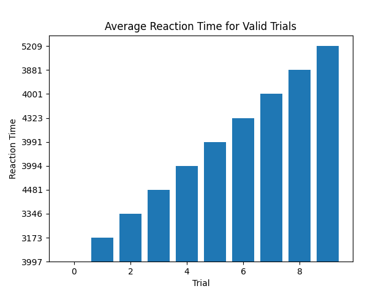

In this lab I learned how to initialize the m5stick and    download the libraries in the arduino IDE.  Additionally I learneed how to write, open, and read a file and the serial port using python. I did have trouble with getting the barchart to display correctly, but otherwise was able to accomplish all parts of the lab.  
 