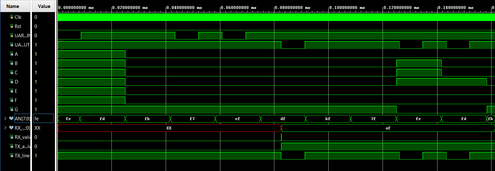

# UART Transceiver — Nexys A7-100T (Verilog / Vivado)

A full-duplex UART transceiver implemented in Verilog and deployed on the Nexys A7-100T FPGA. The design receives an ASCII byte from a PC terminal (PuTTY) at 115200 baud, displays the byte as a two-digit hex value on the onboard seven-segment display, and immediately echoes the byte back to the terminal — all driven by the 100 MHz system clock.

---

## Demo

<!-- PLACEHOLDER: Capture a GIF or short video of PuTTY with characters being typed, echoing back, and the 7-segment display updating in real time. A photo of the Nexys A7 board with the display lit is also great. -->


*PuTTY echoing each keystroke while the seven-segment display shows the received byte in hex*

---

## Simulation / Waveform



---

## Architecture

```
                ┌─────────────────────────────────────────────┐
 PC / PuTTY     │               top_UART_RXTX                  │
 115200 baud ──►│ UART_TXD_IN                                  │
                │        ┌──────────┐  RX_data[7:0]            │
                │        │ UART_RX  ├──────────────┬───────────┤
                │        └──────────┘              │           │
                │          RX_valid ───────────────►───────────► hex_to_ssd
                │                                  │           │  (7-seg display)
                │        ┌──────────┐              │           │
                │        │ UART_TX  │◄─────────────┘           │
                │        └────┬─────┘  TX_valid = RX_valid     │
                │             │         TX_byte  = RX_data     │
                │      TX_active ? TX_line : 1'b1              │
                │             └──────► UART_RXD_OUT ───────────►──► PC / PuTTY
                │                                              │
                │  100 MHz ──► ClkDiv ──► 60 kHz (SSD mux)    │
                └─────────────────────────────────────────────┘
```

---

## Project Structure

| File | Description |
|------|-------------|
| `sources_1/new/top_UART_RXTX.v` | Top-level module — instantiates and wires all submodules |
| `sources_1/new/UART_RX.v` | 4-state FSM receiver (IDLE→START→DATA→STOP) at 115200 baud |
| `sources_1/new/UART_TX.v` | 4-state FSM transmitter (IDLE→START→DATA→STOP) at 115200 baud |
| `sources_1/new/hex_to_ssd_2digit.v` | Splits received byte into nibbles; drives multiplexed 7-segment display at 60 kHz |
| `sources_1/imports/new/ClkDiv.v` | *(Imported from prior project)* Divides 100 MHz clock to 60 kHz for display anode multiplexing |
| `sources_1/imports/new/Binary_Ssd.v` | *(Imported from prior project)* Single-digit 7-segment decoder (`Decoder7Seg` module) used as a building block |
| `sim_1/new/tb_UART_transceiver.v` | Top-level testbench — sends byte `0xAF` via UART task, verifies echo |
| `sim_1/new/tb_UART_TX.v` | Standalone TX testbench |
| `sim_1/new/tb_UART_RX.v` | Standalone RX testbench |
| `sim_1/new/tb_hex_to_ssd.v` | Seven-segment display decoder testbench |
| `constrs_1/imports/.../Nexys-A7-100T-Master.xdc` | Pin constraints for Nexys A7-100T |

---

## Specifications

| Parameter | Value |
|-----------|-------|
| FPGA Board | Nexys A7-100T (Artix-7) |
| System Clock | 100 MHz |
| Baud Rate | 115200 baud |
| Data Format | 8N1 (8 data bits, no parity, 1 stop bit) |
| Clocks per Bit | 868 (100,000,000 / 115,200) |
| Start-bit sample point | (868−1)/2 = 433 clocks after falling edge |
| Display Mux Clock | 60 kHz (from `ClkDiv`, `CLK_SPEED = 60_000`) |
| Display Output | 2-digit hex on seven-segment (anodes AN[0] and AN[1]) |
| Tool | Vivado |
| Language | Verilog |

---

## How It Works

**Clock Domain.** The design runs on the Nexys A7's 100 MHz oscillator. Both UART modules use the raw 100 MHz clock and count 868 cycles per bit period to hit exactly 115200 baud. A separate `ClkDiv` instance divides the 100 MHz clock down to 60 kHz; this slower clock drives the seven-segment anode multiplexer so both digits appear to the eye as simultaneously lit.

**UART Receiver (`UART_RX`).** The receiver implements a 4-state FSM: IDLE, START, DATA, and STOP. In IDLE, it watches the RX line for a falling edge (start bit). On detecting one, it counts to the midpoint of the start bit (433 clocks) and confirms the line is still low before entering DATA state — this center-sampling technique rejects narrow glitches. It then samples each of the 8 data bits at the center of their respective bit periods (every 868 clocks), collecting bits LSB-first into `RX_reg`. After bit 7, it checks for a high stop bit and, on success, asserts `RX_valid` for one clock and latches `RX_reg` into the output `RX_data`.

**UART Transmitter (`UART_TX`).** The transmitter mirrors the receiver. When `TX_valid` is asserted it latches `TX_byte`, asserts `TX_active`, drives the line low for 868 clocks (start bit), then shifts out each bit LSB-first at 868 clocks per bit, and finishes with a high stop bit. The top module gates the output: `UART_RXD_OUT = TX_active ? TX_line : 1'b1`, keeping the line in the idle mark state when nothing is transmitting.

**Echo Loop.** The top module connects `RX_valid → TX_valid` and `RX_data → TX_byte`. The transmitter therefore fires the instant the receiver finishes, creating a zero-software-latency echo: every byte typed in PuTTY is retransmitted back within one bit period.

**Seven-Segment Display (`hex_to_ssd`).** On the falling edge of `RX_valid`, the module latches the lower nibble into `LOWER` and upper nibble into `UPPER`. A 60 kHz clock drives an 8-bit anode shift register that cycles between AN[0] and AN[1]. A 16-entry combinational lookup table maps each 4-bit nibble to the active-low 7-segment encoding for characters `0`–`F`.

---

## Testbenches

| Testbench | What It Tests | Notes |
|-----------|--------------|-------|
| `tb_UART_transceiver.v` | Full loopback — sends `0xAF`, checks echo on `UART_RXD_OUT` | Each bit period is 8680 ns (868 × 10 ns/clock) |
| `tb_UART_TX.v` | TX-only: start bit, 8 data bits, stop bit timing | — |
| `tb_UART_RX.v` | RX-only: drives a synthetic UART frame | — |
| `tb_hex_to_ssd.v` | Display decoder for all 16 hex digits | — |

**To run in Vivado:**
1. Open the project (`uart transceiver.xpr`).
2. In the **Sources** panel, right-click the desired testbench and select **Set as Top**.
3. Click **Run Simulation → Run Behavioral Simulation** in the Flow Navigator.
4. In the waveform window, zoom to a full UART frame (~95 µs) to inspect bit timing.

---

## How to Run

1. **Open the project** — Launch Vivado and open `uart transceiver.xpr`.
2. **Verify sources** — Confirm `top_UART_RXTX.v`, `UART_RX.v`, `UART_TX.v`, `hex_to_ssd_2digit.v`, `ClkDiv.v` (imported), and `Binary_Ssd.v` (imported) appear under Design Sources, and the Nexys A7 XDC under Constraints.
3. **Simulate** — Set `tb_UART_transceiver` as top, run Behavioral Simulation, and verify the waveform.
4. **Synthesize and implement** — Click **Run Synthesis**, then **Run Implementation**. Check that timing constraints pass (100 MHz).
5. **Generate bitstream** — Click **Generate Bitstream**.
6. **Program the board** — Connect the Nexys A7 via USB-JTAG. In the Hardware Manager, click **Open Target → Auto Connect → Program Device** and select the `.bit` file.
7. **Test with PuTTY** — Open PuTTY, select the board's COM port, and configure: **115200 baud, 8 data bits, 1 stop bit, no parity, no flow control**. Type any character — it echoes immediately and the seven-segment display shows its ASCII value in hex.
