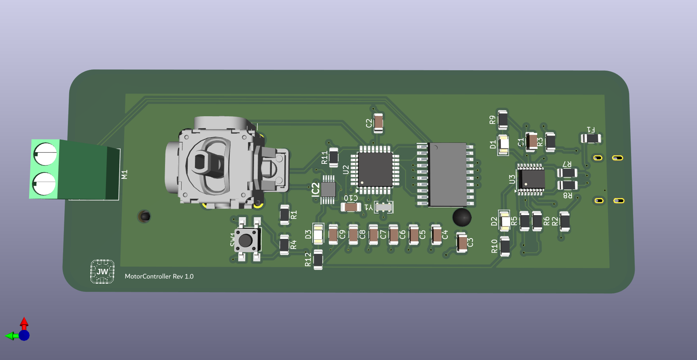
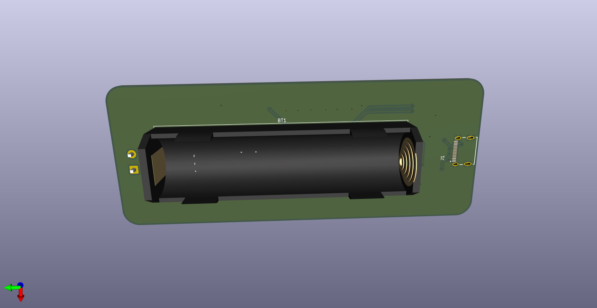
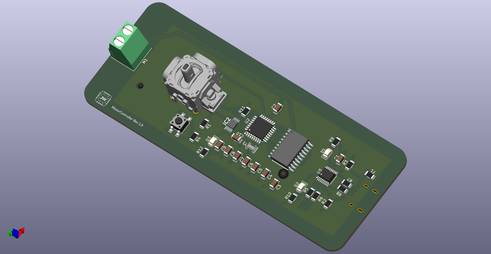

# Joystick Motor Controller — Rev 1.0

A compact, battery-powered DC motor controller built around the ATmega328P. An analog joystick sets motor speed and direction via PWM, with onboard USB-C charging and a USB-UART bridge for serial debugging.

Designed in KiCad 9.0.5.

---

## Board Overview

| | |
|---|---|
| **MCU** | ATmega328P-A @ 16 MHz |
| **Motor Driver** | L293DD dual H-bridge |
| **Battery Charger** | LTC4053EMSE (4.2V Li-ion, 500mA fuse) |
| **USB Bridge** | FT230XS (USB-UART) |
| **Connector** | USB-C 2.0 (USB4215-03-A) |
| **Power Rails** | +5V (USB), +3.3V (FT230XS regulated) |
| **Motor Output** | 2-pin screw terminal |
| **Input** | Analog joystick (X/Y axes + switch) |
| **Crystal** | 16 MHz |
| **Status LEDs** | TX, RX, CHRG, STATUS |
| **PCB Tool** | KiCad 9.0.5 |
| **Status** | Designed — not yet fabricated |

---

## Block Diagram

```
USB-C ──► LTC4053 Charger ──► Li-ion Battery
   │
   ▼
 +5V Rail
   │
   ├──► ATmega328P ◄── Joystick (ADC)
   │         │
   │         ├── PWM ──► L293DD ──► DC Motor (M1)
   │         └── UART ──► FT230XS ──► USB-C
   │
   └──► FT230XS (3.3V LDO out)
```

---

## Features

- **Joystick-driven PWM control** — analog X/Y axes read via ATmega ADC; joystick switch mapped to a configurable function
- **Bidirectional motor drive** — L293DD H-bridge supports forward/reverse with enable PWM
- **Onboard Li-ion charging** — LTC4053 charges a single-cell battery via USB-C; CHRG and FAULT status exposed via LEDs
- **USB-UART bridge** — FT230XS provides serial debug access without an external programmer
- **Reset button** — dedicated SW1 for ATmega reset
- **Compact form factor** — all major ICs on top side; battery holder on back

---

## Pin Mapping (ATmega328P)

| Signal | ATmega Pin |
|---|---|
| Motor IN_1 | PD3 (OC2B, PWM) |
| Motor IN_2 | PD4 |
| Motor EN | PD5 (OC0B, PWM) |
| Joystick X | PC0 (ADC0) |
| Joystick Y | PC1 (ADC1) |
| Joystick SW | PD2 |
| UART TX | PD1 |
| UART RX | PD0 |

---

## Board Images

**Front**



**Back**



**Schematic**



---

## Repository Structure

```
motor-controller-pcb/
├── README.md
├── MotorController.kicad_sch
├── MotorController.kicad_pcb
├── gerbers/
│   └── *.gbr, *.drl
├── bom/
│   └── BOM.csv
└── docs/
    ├── front.png
    ├── back.png
    ├── MotorController.png
    └── MotorController.pdf
```

---

## Tools

- **EDA**: KiCad 9.0.5
- **MCU Toolchain**: AVR-GCC / Arduino framework

---

## Author

Jordan Williams — [GitHub](https://github.com/jo0wi)
