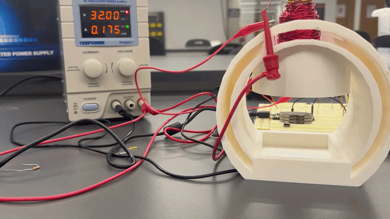

# Magnetic Levitator — Raspberry Pi Pico (RP2040)

A closed-loop magnetic levitation system that suspends a permanent magnet in mid-air using a custom 429-turn solenoid, a Hall effect sensor, and a cascaded PD + discrete lead compensator implemented in MicroPython. The system continuously measures the magnet's position via Hall voltage and adjusts solenoid current through a PWM-controlled MOSFET to maintain a stable 3 mm levitation gap against gravity — an inherently unstable equilibrium.

---

## Demo

<!-- PLACEHOLDER: Add a GIF or short video clip of the magnet levitating -->


*Neodymium magnet suspended at 3 mm below solenoid, stabilized by closed-loop feedback*

---

## Architecture

```
                   ┌──────────────────────────────────────────┐
                   │           Raspberry Pi Pico (RP2040)      │
                   │                                           │
  Hall Sensor ─────┤ ADC0 (GP26)                               │
  (position)       │      │                                    │
                   │      ▼                                    │
                   │  Outer Loop: PD Position Controller       │
                   │  error = TARGET_V(2.05V) - V_hall         │
                   │  desired_current = Kp·e + Kd·ė           │
                   │      │                                    │
  Shunt Op-Amp ────┤ ADC1 (GP27)                               │
  (current sense)  │      │                                    │
                   │      ▼                                    │
                   │  Inner Loop: Discrete Lead Compensator    │
                   │  error_i = desired_current - I_measured   │
                   │  u[k] = b0·e[k] + b1·e[k-1] - a1·u[k-1] │
                   │      │                                    │
                   │      ▼                                    │
                   │  PWM Output (GP16) @ 10 kHz               │
                   └──────────────────┬───────────────────────┘
                                      │ PWM duty cycle
                                      ▼
                               ┌─────────────┐
                               │ IRLZ44N     │
                               │ N-MOSFET    │
                               └──────┬──────┘
                                      │ Switched current
                                      ▼
                              ┌───────────────┐
                              │ 429-turn      │        ┌──────────────┐
                              │ Solenoid      │◄───────│ 9V Supply    │
                              │ (Electromagnet)│        └──────────────┘
                              └───────┬───────┘
                                      │ Magnetic force (upward)
                                      ▼
                               ╔═════════════╗
                               ║  Neodymium  ║  ← Levitating magnet
                               ║   Magnet    ║     (~3 mm gap)
                               ╚═════════════╝
                                      │ Gravity (downward)
                                      ▼
                              ┌───────────────┐
                              │ Hall Sensor   │ → feedback to ADC0
                              └───────────────┘
```

---

## Project Structure

```
Magnetic_Levitator/
├── 3magnets.py              # Final PD controller — 3-magnet stack configuration
├── 3mags2controllers.py     # Cascaded PD + lead compensator — dual-loop final design
├── Final_Report.tex         # LaTeX source for ELEE4220 final project report
├── MagLev_FinalReport.pdf   # Compiled final report
├── finalliveformag.mlx      # MATLAB Live Script — plant modeling and controller design
├── IMG_0415.mov             # Video of levitation demo
├── milestone 2/
│   └── levitator.py         # ADC baseline — reads and prints Hall sensor voltage only
├── milestone3/
│   ├── controller.py        # Discrete difference-equation controller (3rd-order)
│   ├── simple.py            # Basic P-only controller for initial hardware validation
│   ├── mosfettest.py        # PWM duty sweep to verify MOSFET and solenoid wiring
│   └── test.py              # Combined PWM sweep + Hall sensor characterization
└── milestone 4/
    └── P.py                 # Placeholder (empty)
```

---

## Specifications

| Parameter | Value |
|---|---|
| Microcontroller | Raspberry Pi Pico (RP2040) |
| Language | MicroPython |
| PWM frequency | 10 kHz |
| Control loop rate | 1 kHz (1 ms sample period) |
| ADC resolution | 16-bit (0–65535) |
| ADC reference voltage | 3.3 V |
| Target Hall voltage (setpoint) | 2.05 V |
| Levitation gap (h₀) | 3 mm |
| Max solenoid current | 0.3 A (thermal limit) |
| Solenoid turns (N) | 429 |
| Shunt resistance | 0.185 Ω |
| Current-sense op-amp gain | 8.5 V/V |
| Outer loop Kp | 1.46 × 10⁶ |
| Outer loop Kd | 1.14 × 10⁵ |
| Inner loop (lead compensator) | b₀ = 2.865, b₁ = 1.915, a₁ = 0.752 |
| Derivative smoothing factor (α) | 0.1 |
| PWM duty range | 100–35,000 (out of 65,535) |
| Hall sensor pin | ADC0 — GPIO 26 |
| Shunt op-amp pin | ADC1 — GPIO 27 |
| PWM output pin | GPIO 16 |
| MOSFET | IRLZ44N N-channel |
| Power supply | 9 V |
| Course | ELEE4220 — Feedback Control Systems |

---

## How It Works

**Plant Modeling**

The system is an inherently unstable second-order plant. Magnetic force on the permanent magnet is inversely proportional to the square of the air gap: `F = K·I / h²`. Linearizing around the equilibrium gap h₀ = 3 mm produces an unstable transfer function with a right-half-plane pole — meaning any perturbation without feedback will send the magnet crashing into the solenoid or falling away. The plant was characterized in MATLAB using the physical parameters of the solenoid (N = 429 turns, A = 100 mm²) and the magnet mass.

**Outer Position Loop — PD Controller**

A Hall effect sensor mounted below the solenoid measures the magnetic field strength, which maps monotonically to magnet position. The sensor outputs a voltage between ~1.6 V (magnet close) and ~3.3 V (magnet far). The outer controller computes the position error relative to the 2.05 V setpoint and outputs a desired current using a PD law: `I_desired = Kp·e + Kd·ė`. Derivative action is low-pass filtered with α = 0.1 to suppress noise amplification. An initial 200 ms startup pulse at 25,000/65,535 duty "grabs" the magnet before the feedback loop takes over.

**Inner Current Loop — Discrete Lead Compensator**

A 0.185 Ω shunt resistor in series with the solenoid, buffered through an op-amp with gain 8.5 V/V, feeds a second ADC channel to measure actual coil current. The inner loop closes around this current measurement using a discrete lead compensator: `u[k] = b₀·e[k] + b₁·e[k-1] - a₁·u[k-1]`. This rejects coil inductance dynamics and improves current tracking bandwidth, giving the outer position controller a faster, more linear actuator to work with. A spike-damping correction term further reduces overshoot when measured current exceeds the desired value.

**Stability and Limitations**

The cascaded controller achieves temporary stable levitation. Long-term stability degrades due to thermal drift in the solenoid resistance (which shifts the current-to-force mapping) and saturation of the coil's inductance at higher duty cycles. The system is extremely sensitive to external disturbances at the 3 mm gap, which is the linearization point — any large perturbation exits the linear region and the controller cannot recover without a re-grab.

---

## Testbenches

| File | Purpose | How to Run |
|---|---|---|
| `milestone3/mosfettest.py` | Sweeps PWM duty 0→65535 in steps to verify MOSFET gate drive and solenoid response | Flash to Pico via Thonny; observe current draw on bench supply |
| `milestone3/test.py` | Simultaneously sweeps PWM and logs Hall sensor voltage at each step | Flash to Pico; copy printed table to characterize Hall vs. duty curve |
| `milestone 2/levitator.py` | Reads and prints raw Hall sensor voltage only — no actuation | Use to verify sensor wiring and map voltage to physical position |
| `milestone3/simple.py` | P-only controller (Kp = 20,000) for initial stability trials | Flash and hold magnet near sensor; observe if it catches |

---

## How to Run

### Requirements
- Raspberry Pi Pico flashed with MicroPython firmware
- [Thonny IDE](https://thonny.org/) or `mpremote`
- 9 V DC power supply connected to solenoid circuit
- Hall effect sensor, IRLZ44N MOSFET, and 0.185 Ω shunt wired per schematic

### Steps

1. **Flash MicroPython** onto the Pico if not already done (hold BOOTSEL, drag `.uf2` firmware onto the drive).
2. **Open Thonny** and connect to the Pico via USB serial.
3. **Wire the hardware:**
   - Hall sensor output → GP26 (ADC0)
   - Shunt op-amp output → GP27 (ADC1)
   - MOSFET gate → GP16 (PWM)
   - Solenoid and 9 V supply in series with the 0.185 Ω shunt through the MOSFET drain
4. **For single-loop PD only**, open `3magnets.py` and run it. Hold the magnet ~5–10 mm below the solenoid before the 0.2 s startup pulse completes.
5. **For full cascaded control**, use `3mags2controllers.py` — same startup procedure.
6. Monitor serial output for `V: | E: | D: | PWM:` debug lines to verify the control loop is tracking toward 2.05 V.

<!-- PLACEHOLDER: Add a wiring diagram photo or Fritzing schematic showing solenoid, MOSFET, shunt, op-amp, and Pico pinout -->
